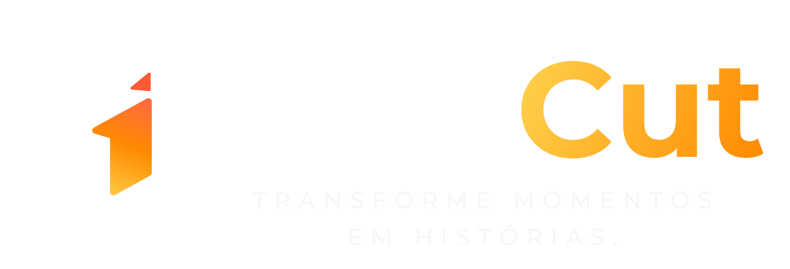

# HolyCut — Brand Kit

> Transforme momentos em histórias.



Tudo nesta pasta, exceto `fontes/` e `referencia/`, é gerado por [gerar_brand_kit.py](gerar_brand_kit.py). Para mudar uma cor ou uma forma, edite o script e rode de novo. Não edite os SVGs à mão.

```
pip install -r brand/requirements.txt
python brand/gerar_brand_kit.py
```

Os PNGs são renderizados pelo Edge ou Chrome em modo headless. Se nenhum for encontrado, defina a variável `HOLYCUT_NAVEGADOR` com o caminho do executável.

## Logos

| Arquivo | Quando usar |
|---|---|
| `logo/holycut-horizontal.svg` | Logo principal, em fundo escuro |
| `logo/holycut-horizontal-slogan.svg` | Com o slogan, para landing, capas e materiais |
| `logo/holycut-horizontal-fundo-claro.svg` | Logo principal em fundo claro |
| `logo/holycut-horizontal-branco.svg` / `-preto.svg` | Uma cor só: marca d'água, bordado, carimbo |
| `logo/holycut-simbolo.svg` | Só o símbolo, quando o nome já aparece por perto |

Cada logo tem versão com slogan e PNG em `logo/png/`.

**Regras de uso:**
- O texto dos logos está convertido em contorno. O logo não depende da fonte instalada.
- A margem livre em volta do logo é, no mínimo, a largura da haste esquerda do "H".
- No fundo claro, use sempre a versão `fundo-claro`, porque o amarelo do "Cut" perde contraste no branco.
- Não distorça, não gire e não troque as cores do símbolo.

## Ícones do app

| Arquivo | Uso |
|---|---|
| `app-icon/icone-escuro.svg` | Ícone padrão |
| `app-icon/icone-claro.svg` | Alternativa em fundo branco |
| `app-icon/icone-gradiente.svg` | Destaques e campanhas |
| `app-icon/icone-maskable-*.png` | PWA no Android, com o símbolo dentro da zona segura |
| `app-icon/apple-touch-icon.png` | Atalho na tela inicial do iPhone |
| `app-icon/favicon.svg` / `favicon.ico` | Aba do navegador |

## Cores

Os valores oficiais estão em [tokens/design-tokens.css](tokens/design-tokens.css) e [tokens/cores.json](tokens/cores.json).

| Token | Cor | Uso |
|---|---|---|
| `ink` | `#0B0B0F` | Fundo principal |
| `surface` | `#131317` | Cards |
| `surface-2` | `#1A1A1F` | Elementos dentro de cards |
| `border` | `#2A2A32` | Bordas e divisores |
| `text` | `#F5F5F7` | Texto principal |
| `muted` | `#9C9EA8` | Texto secundário |
| `yellow` | `#FFD24D` | Destaques |
| `orange` | `#FF8A00` | Acento principal e hover |
| `coral` | `#FF6A3D` | Detalhes do símbolo |
| `red` | `#FF6B6B` | Alertas e erros (a dobra do símbolo continua `#FF5A36`) |
| `violet` | `#A855F7` | Elementos de IA |
| `magenta` | `#F05BFF` | Acento secundário de IA |
| `cyan` | `#43D9FF` | Dados e ícones |

| Gradiente | Uso |
|---|---|
| `marca` | "Cut" do logo e destaques quentes |
| `cta` | Botões principais, como o "Comece agora" |
| `ia` | Tudo que é feito pela IA |
| `brand` | Ilustrações e fundos de campanha |

## Tipografia

| Fonte | Uso |
|---|---|
| **Montserrat** | Títulos, destaques e o logo |
| **Inter** | Interface e textos |
| **Caveat** | Legendas manuscritas, como "Digno" e "Culto de hoje" |

As três estão em `fontes/` com licença OFL, que permite uso comercial e queimar o texto no vídeo.

## Referências

- `referencia/moodboard.png` e `referencia/styleboard.png` — pranchas visuais que definiram a marca.
- `referencia/kit-v1-original/` — o kit gerado na outra conversa, guardado como histórico. O símbolo daquela versão não seguia o styleboard e foi redesenhado aqui.
